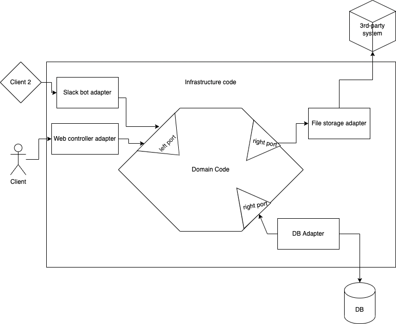

# Hexagonal Architecture Learning Hour

Hexagonal Architecture, or, properly named, Ports & Adapters Architecture — is the approach of 
drawing a strong boundary between your business domain code and your infrastructure code.

## What belongs to which?

- Business domain code — your business logic, models and rules.
- Infrastructure code — anything that has to deal with the outside world, specific technology or 
  UI/presentation.

## What are the facets of this architecture?

1. Replaceable dependencies.
2. Protection from infrastructure code infecting domain code and vice versa.
3. Higher degree of testability of the domain code.
4. Design by purpose instead of by technology.

## There are two types of ports



### Left port

"Left port" & its adapters are responsible for handling the input from the user/client of the
system. They are usually the ones calling the domain code. The adapter in that case doesn't implement
the port's interface, but uses it instead. Another name for this is "Driving port."

For the left port, your domain code will define the interface how the input controller should call it
and then have the input controller make that call. Pseudo-code example:

```
// domain code

interface CreateDepositPort {
  create(deposit: CreateDepositInput)
}

// infrastructure code

class DepositsWebAdapter {
  @post
  createDeposit(request: Request, response: Response) {
    deposit = new CreateDepositInput({ ... })
    createDepositPort.create(deposit)
    response.send({ ... })
  }
}
```

There are also rare cases when the left adapter may be implementing some methods of the left port. This 
is when you need the domain code to call back to the left port to either request more information from 
the client or something else.

### Right port

"Right port" & its adapters are responsible for talking to the "awful outside world" or some specific 
technology that you don't want to reference directly from your domain code. These ports are the ones
that the domain code is calling. Adapters here always implement the port's interface. Another name for
this is "Driven port."

For the right port, your domain code will define and interface and make a call to it. Then the
infrastructure code will implement this interface in the form of one or more adapters. These adapters
will communicate to the outside world or to the library/technology that we wish to protect our domain
code from. Pseudo-code example:

```
// domain code

interface DepositDBPort {
  save(deposit: Deposit)
  find(id: ID): Deposit
}

depositDBPort.save(deposit)

// infrastructure code

class DepositDBMySQLAdapter {
  save(deposit: Deposit) {
    this.sql(" .... ", ...);
  }
  
  find(id: ID): Deposit {
    return this.toDeposit(
      this.sql(" .... ", ...)
    )
  }
}
```

## Kata: Time tracking

You have been tasked to implement an application for personal time tracking. Here are the use cases that
you need to support in the first version:

1. Clock-in — user provides the name of the task as the input, and the task gets created with the start
   timestamp. The task is marked as current.
2. Clock-out — the current task gets stopped and the ending timestamp is stored. User gets in response
   how long this task has taken.
3. List all tasks — user requests all tasks. User gets in response the list with task names, starting
   and ending timestamps, and how long did the task take.

Extra requirements:

- For the first version, store tasks in a single JSON file, however, in one of the next iterations we'll
  have to introduce a proper SQL database (we haven't decided which one yet).
- For the first version, the user will interact with the application via JSON-based web API directly
  (probably using Postman or Insomnia as a client). In the next version, we may implement a web, desktop
  or CLI client, depending on the results of the market research.

Please apply the Ports & Adapters Architecture when designing the solution.
